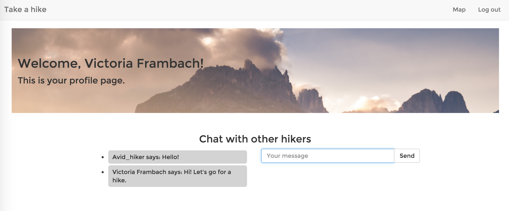

## Project 1 -- Take a Hike app

Take a Hike app provides information about hiking-related meetups around a zip code, and shows their location on a map. Users can create a log in or sign in with Meetup.com, and chat with other logged in users.

## Link to Heroku hosted project

[https://takeahike-app.herokuapp.com](https://takeahike-app.herokuapp.com)

## Technologies

* Meetup API
* Google Maps API
* Passport
* Express
* Node.js
* Heroku
* MongoDB
* Javascript
* Bootstrap
* jQuery
* CSS
* HTML

## Wish List/ Future Development
* Further refine search results to filter out non-hiking events
* Drop a pin on the map to search for meetups
* Display date and time of event, if available